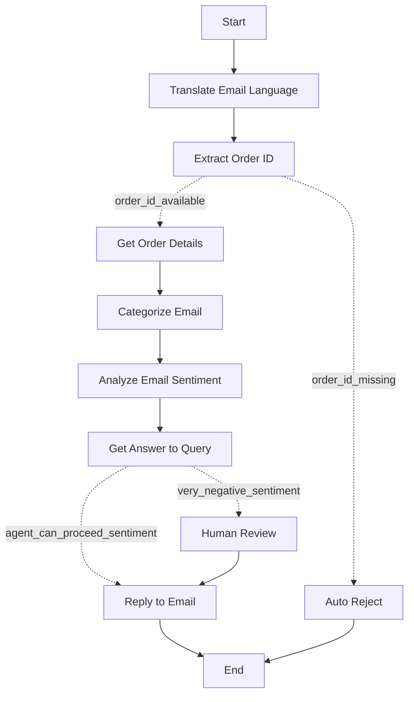

### ✨ **AssistmAIgic** – Intelligent Email Agent for Order & Product Support

**AssistmAIgic** is a specialized automation agent designed to streamline customer email handling for product orders and inquiries. Built on LangGraph’s state machine architecture and integrated with UiPath’s Model Context Portal (MCP), it delivers fast, accurate, and context-aware responses while ensuring human oversight for sensitive cases.


---

## Mermaid diagram 

---
### Key Capabilities

1. **Multilingual Email Handling**
   - Accepts customer emails in any language.
   - Automatically translates incoming emails to a processing language (e.g., English, Marathi, Hindi).
   - Replies are generated and translated back into the customer's original language for seamless and personalize communication.

2. **Order ID Extraction & Validation**
   - Parses email content to extract an 8-digit order ID.
   - If found, retrieves order details via MCP tools.
   - If missing, sends a polite rejection email requesting the order ID.

3. **Email Categorization & Sentiment Analysis**
   - Classifies emails into categories like:
     - *Product Inquiry*
     - *Order Status*
     - *Complaint*
     - *etc.*
   - Assesses sentiment as *Positive*, *Negative*, or *Very Negative*.

4. **Contextual Response Generation**
   - Uses a grounding retriever to pull relevant product specs, warranty info, and FAQs from the knowledge base.
   - Crafts informative, personalized replies based on the customer's query and order context.

5. **Human-in-the-Loop (HITL) Escalation**
   - If sentiment is *Very Negative*, the agent routes the draft response to a human reviewer for approval or refinement ensuring empathy and precision in sensitive situations.

6. **Automated Response Delivery**
   - Sends the final email response (automated or HITL-approved) to the customer in their original language.

7. **Interaction Logging**
   - Logs the outcome of each email interaction for traceability and analytics.

---

### Benefits

- Reduces manual workload for support teams.
- Ensures fast, multilingual customer service.
- Escalates complex or emotional cases to human agents.
- Maintains high accuracy and contextual relevance in responses.

---
## 0) Local Environment Setup (with `uv`)

This project assumes you’re using [`uv`](https://github.com/astral-sh/uv) for fast Python installs, virtualenvs, and command execution.

### 0.1 Install Python 3.12+ if not installed

```bash
# Install a modern Python (adjust the version if you need)
uv python install 3.12
```
### 0.2 Clone the repository
```bash
git clone https://github.com/ashokkarale/assistmAIgicCodedAgent.git
cd assistmAIgicCodedAgent
```
### 0.3 Install dependencies
```bash
uv pip install -r requirements.txt
```
### 0.4 Configure environment variables

Create a .env file and add MCP server URL:
```
# MCP Server
MCP_SERVER_URL=https://your-mcp-server-url-will-go-here
```

### 0.5 Run the UiPath CLI via `uv`

Using `uv run` means you don’t have to activate the venv:
> **Tip:** You don’t need to “activate” the venv if you use `uv run ...`, but if you prefer activation:
>
> -   macOS/Linux: `source .venv/bin/activate`
> -   Windows PowerShell: `.venv\Scripts\Activate.ps1`

```bash
# Log in and write credentials to .env
uv run uipath auth

# Initialize (scans entrypoints and updates uipath.json)
uv run uipath init

# Interactive dev loop (recommended)
uv run uipath dev

# Non-interactive run of classic entrypoint
uv run uipath run main.py '{"message_id": "AAMkAGMwYTQyNTZhLTkxN2ItNGFlNi1iOWViLWM1....[Mail MessageId]", "email_subject":"Order Confirmation - Order #10001018", "email_body": "I recently bought Aeroquiet product and it stopped working in couple of weeks!"}'

# If you exposed a compiled graph entrypoint called "agent"
# (name exposed in langgraph.json)
uv run uipath run agent -f .\input.json
```
---
## 1) UiPath Resources setup required
-   Setup you will have to do to run the agent
### 1.1 MCP Tools
-   Download and deploy the MCP tools from the project folder 'MCP Tools'
-   **Tool Details:**
    - **TranslateEmailSubjectAndBodyLanguage** - Translate email subject and body language to agent language if the email is not in agent language.
    - **GetOrderDetailsByOrderId** - Get Order Details by Order Id.
    - **CategorizeEmail** - Categorize email as per the email subject & body content.
    - **ReplyToEmail** - Send email reply.
    - **HITL_Review** - Action app to review email response generated by the agent for 'Very Negative' sentiment email.
 
### 1.2 MCP Server
- Create UiPath MCP Server and add the deployed tools to the server with descriptions.
  

### 1.3 Storage Buckets
- Create a storage bucket for Order Database. eg. AssistemAIgic DB. Sample CSV db provided in the project folder **AssistmAIgic DB**
- Create a storage bucket for storing product, services, support, warrenty and every document required for providing good customer support. e.g. **AssistmAIgic Context**. Sample documents provided in the project.

### 1.4 Indexes
- Create a RAG Context Grounding Index which will be used by the agent to generate accurate response. e.g. AssistmAIgic_Index. Remember if you choose another name than this example, you will have to update it into `main.py` in the below logic.

```python
# Initialize Context Grounding for company policy
context_grounding = ContextGroundingRetriever(
    index_name="AssistmAIgic_Index",
    folder_path="Shared",
    number_of_results=1
    )
```
---
## 2) Core Developer Workflow (CLI)

The **unified CLI** supports both classic automations and LangGraph agents.

### 2.1 Authenticate

```bash
uipath auth
```

-   Opens a browser login and writes credentials to `.env`.
-   Required before local runs or publishing.

### 2.2 Initialize

```bash
uipath init

```

-   Scans the classic entrypoint (`main.py`) and creates/updates `uipath.json` with **input/output schema** and **resource bindings**.
-   Re‑run when you change function signatures, add Assets/Queues/Buckets, or new graph entrypoints.

### 2.3 Local Run & Debug

```bash
# Interactive development mode (recommended)
uipath dev

# Non‑interactive quick runs
uipath run main.py '{"message_id": "AAMkAGMwYTQyNTZhLTkxN2ItNGFlNi1iOWViLWM1....[Mail MessageId]", "email_subject":"Order Confirmation - Order #10001018", "email_body": "I recently bought Aeroquiet product and it stopped working in couple of weeks!"}'
# For a compiled graph
uipath run agent -f .\input.json
```

-   `dev` shows live logs, traces, and chat history.

### 2.4 Package, Publish, Deploy

```bash
uipath pack
uipath publish
uipath deploy
```

-   `deploy` is a wrapper that packs and publishes to your Orchestrator feed.
-   Use per‑environment pipelines (Dev → Test → Prod folders/tenants).

### 2.5 Other Useful Commands

```bash
uipath invoke           # Execute a process remotely (when configured)
uipath eval             # Run evaluation scenarios for agents
uipath --help           # Discover flags and subcommands
```
---
## 3) Environment, Credentials & Configuration

Both SDKs read their configuration from **environment variables** (directly, or via `.env` loaded by `python-dotenv`).

### 3.1 Minimal local `.env`

```bash
UIPATH_URL="https://cloud.uipath.com/ORG/TENANT"
UIPATH_ACCESS_TOKEN="your-token"
UIPATH_TENANT_ID="your-tenant-id"
UIPATH_ORGANIZATION_ID="your-organization-id"
MCP_SERVER_URL=https://your-mcp-server-url-will-go-here

# Common defaults
UIPATH_FOLDER_PATH="Shared"
```
---

---
## 4) Links

-   Project README: `./README.md`
-   UiPath Python SDK docs & samples: https://uipath.github.io/uipath-python/
-   UiPath LangGraph SDK docs & samples: https://uipath.github.io/uipath-python/langchain/quick_start/
